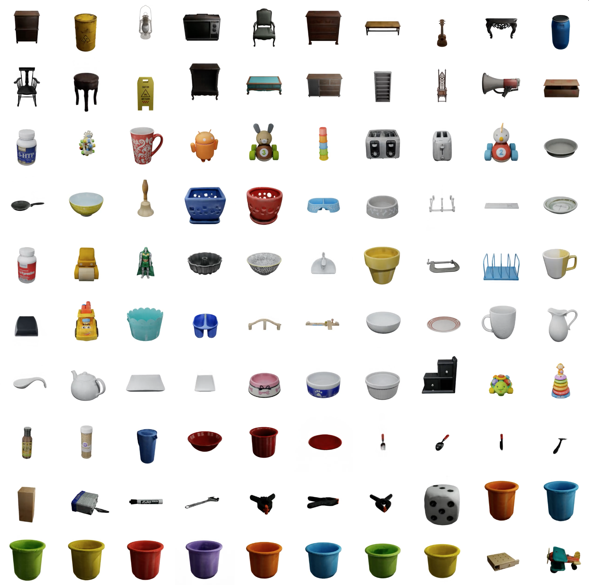

## ObjectFolder: A Dataset of Objects with Implicit Visual, Auditory, and Tactile Representations (CoRL 2021)
[[Project Page]](https://ai.stanford.edu/~rhgao/objectfolder/)    [[arXiv]](https://arxiv.org/abs/2109.07991) 


<br/>

[ObjectFolder: A Dataset of Objects with Implicit Visual, Auditory, and Tactile Representations](https://arxiv.org/abs/2109.07991)  
 [Ruohan Gao](https://www.ai.stanford.edu/~rhgao/),  [Yen-Yu Chang](https://yuyuchang.github.io/),  [Shivani Mall](), [Li Fei-Fei](https://profiles.stanford.edu/fei-fei-li), [Jiajun Wu](https://jiajunwu.com/)<br/>
 Stanford University  
 In Conference on Robot Learning (**CoRL**), 2021  
 
<br/>

If you find our code or project useful in your research, please cite:

    @inproceedings{gao2021ObjectFolder,
      title = {ObjectFolder: A Dataset of Objects with Implicit Visual, Auditory, and Tactile Representations},
      author = {Gao, Ruohan and Chang, Yen-Yu and Mall, Shivani and Fei-Fei, Li and Wu, Jiajun},
      booktitle = {CoRL},
      year = {2021}
    }

### About ObjectFolder Dataset



ObjectFolder is a dataset of 100 objects in the form of implicit representations. It contains 100 Object Files each containing the complete multisensory profile for an object instance. Each Object File implicit neural representation network contains three sub-networks---VisionNet, AudioNet, and TouchNet, which through querying with the corresponding extrinsic parameters we can obtain the visual appearance of the object from different views, impact sounds of the object at each position, and tactile sensing of the object at every surface location, respectively. The dataset contains common household objects of diverse categories such as bowl, mug, cabinet, television, shelf, fork, and spoon. See the paper for details.

<br/>

### Dataset Download and Preparation
```
git clone https://github.com/rhgao/ObjectFolder.git
cd ObjectFolder/ObjectFolder1.0
wget https://download.cs.stanford.edu/viscam/ObjectFolder/ObjectFolder1.0.tar.gz
tar -xvf ObjectFolder1.0.tar.gz
pip install -r requirements.txt
```

### Rendering visual, auditory, and tactile sensory data 
Run the following command to render images, impact sounds, and tactile RGB images:
```
  $ python evaluate.py --object_file_path path_of_ObjectFile \
      --vision_test_file_path path_of_vision_test_file \
      --vision_results_dir path_of_vision_results_directory \
      --audio_vertices_file_path path_of_audio_testing_vertices_file \
      --audio_forces_file_path path_of_forces_file \
      --audio_results_dir path_of_audio_results_directory \
      --touch_vertices_file_path path_of_touch_testing_vertices_file \
      --touch_results_path path_of_touch_results_directory
```
This code can be run with the following command-line arguments:
  * `--object_file_path`: The path of ObjectFile.
  * `--vision_test_file_path`: The path of the testing file for vision, which should be a npy file.
  * `--vision_results_dir`: The path of the vision results directory to save rendered images.
  * `--audio_vertices_file_path`: The path of the testing vertices file for audio, which should be a npy file.
  * `--audio_forces_file_path`: The path of forces file for audio, which should be a npy file.
  * `--audio_results_dir`: The path of audio results directory to save rendered impact sounds as .wav files.
  * `--touch_vertices_file_path`: The path of the testing vertices file for touch, which should be a npy file.
  * `--touch_results_dir`: The path of the touch results directory to save rendered tactile RGB images.

### Data format
  * `--vision_test_file_path`: It is a npy file with shape of (N, 6), where N is the number of testing viewpoints. Each data point contains the coordinates of the camera and the light in the form of (camera_x, camera_y, camera_z, light_x, light_y, light_z).
  * `--audio_vertices_file_path`: It is a npy file with shape of (N, 3), where N is the number of testing vertices. Each data point represents a coordinate on the object in the form of (x, y, z).
  * `--audio_forces_file_path`: It is a npy file with shape of (N, 3), where N is the number of testing vertices. Each data point represents the force values for the corresponding impact in the form of (F_x, F_y, F_z).
  * `--touch_vertices_file_path`: It is a npy file with shape of (N, 3), where N is the number of testing vertices. Each data point contains a coordinate on the object in the form of (x, y, z).

### Demo
Below we show an example of rendering the visual, auditory, and tactile data from the ObjectFile implicit representation for one object:
```
  $ python evaluate.py --object_file_path Objects/25/ObjectFile.pth \
      --vision_test_file_path demo/vision_demo.npy \
      --vision_results_dir demo/vision_results/ \
      --audio_vertices_file_path demo/audio_demo_vertices.npy \
      --audio_forces_file_path demo/audio_demo_forces.npy \
      --audio_results_dir demo/audio_results/ \
      --touch_vertices_file_path demo/touch_demo_vertices.npy \
      --touch_results_dir demo/touch_results/
```

The rendered images, impact sounds, tactile images will be saved in `demo/vision_results/`, `demo/audio_results/`, and `demo/touch_results/`, respectively.

### Acknowlegements
The code for the neural implicit representation network is adapted from Yen-Chen Lin's [PyTorch implementation](https://github.com/yenchenlin/nerf-pytorch) of [NeRF](https://www.matthewtancik.com/nerf) and Michelle Guo's TensorFlow implementation of [OSF](https://www.shellguo.com/osf/).

### License
ObjectFolder is CC BY 4.0 licensed, as found in the LICENSE file. The 100 high quality 3D objects originally come from online repositories including: 20 objects from [3D Model Haven](https://3dmodelhaven.com/), 28 objects from the [YCB dataset](http://ycb-benchmarks.s3-website-us-east-1.amazonaws.com/), and 52 objects from [Google Scanned Objects](https://app.ignitionrobotics.org/GoogleResearch/fuel/collections/Google\%20Scanned\%20Objects). Please also refer to their original lisence file.
