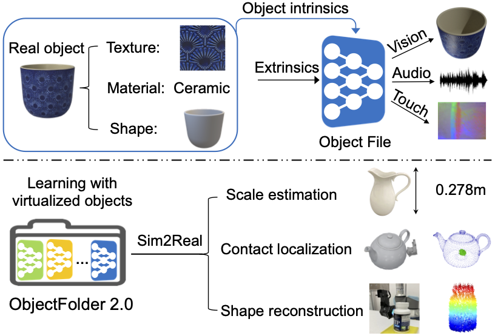

## ObjectFolder 2.0
ObjectFolder 2.0: A Multisensory Object Dataset for Sim2Real Transfer (CVPR 2022)
[[Project Page]](https://ai.stanford.edu/~rhgao/objectfolder2.0/)    [[arXiv]](https://arxiv.org/abs/2204.02389) 



<br/>

[ObjectFolder 2.0: A Multisensory Object Dataset for Sim2Real Transfer](https://ai.stanford.edu/~rhgao/objectfolder2.0/)  
 [Ruohan Gao*](https://www.ai.stanford.edu/~rhgao/),  [Zilin Si*](https://si-lynnn.github.io/), [Yen-Yu Chang*](https://yuyuchang.github.io/),  [Samuel Clarke](https://samuelpclarke.com/), [Jeannette Bohg](https://web.stanford.edu/~bohg/), [Li Fei-Fei](https://profiles.stanford.edu/fei-fei-li), [Wenzhen Yuan](http://robotouch.ri.cmu.edu/yuanwz/), [Jiajun Wu](https://jiajunwu.com/)<br/>
 Stanford University, Carnegie Mellon University<br/>
 In Conference on Computer Vision and Pattern Recognition (**CVPR**), 2022  
 
<br/>

If you find our dataset, code or project useful in your research, we appreciate it if you could cite:

    @inproceedings{gao2022ObjectFolderV2,
      title = {ObjectFolder 2.0: A Multisensory Object Dataset for Sim2Real Transfer},
      author = {Gao, Ruohan and Si, Zilin and Chang, Yen-Yu and Clarke, Samuel and Bohg, Jeannette and Fei-Fei, Li and Yuan, Wenzhen and Wu, Jiajun},
      booktitle = {CVPR},
      year = {2022}
    }

    @inproceedings{gao2021ObjectFolder,
      title = {ObjectFolder: A Dataset of Objects with Implicit Visual, Auditory, and Tactile Representations},
      author = {Gao, Ruohan and Chang, Yen-Yu and Mall, Shivani and Fei-Fei, Li and Wu, Jiajun},
      booktitle = {CoRL},
      year = {2021}
    }
    
### About ObjectFolder Dataset

ObjectFolder 2.0 is a dataset of 1,000 objects in the form of implicit representations. It contains 1,000 Object Files each containing the complete multisensory profile for an object instance. Each Object File implicit neural representation network contains three sub-networks---VisionNet, AudioNet, and TouchNet, which through querying with the corresponding extrinsic parameters we can obtain the visual appearance of the object from different views and lighting conditions, impact sounds of the object at each position of specified force profile, and tactile sensing of the object at every surface location for varied rotation angels and pressing depth, respectively. The dataset contains common household objects of diverse categories such as wood desks, ceramic bowls, plastic toys, steel forks, glass mirrors, etc. The objects.csv file contains the metadata for these 1,000 objects. Note that the first 100 objects are the same as ObjectFolder 1.0, and we recommend using the new version for improved multisensory simulation and implicit representation for the objects. See the paper for details.

<br/>

### Prerequisites
* OS: Ubuntu 20.04.2 LTS
* GPU: >= NVIDIA GTX 1080 Ti with >= 460.73.01 driver
* Python package manager `conda`

### Setup
```
git clone https://github.com/rhgao/ObjectFolder.git
cd ObjectFolder
export OBJECTFOLDER_HOME=$PWD
conda env create -f $OBJECTFOLDER_HOME/environment.yml
source activate ObjectFolder-env
```

### Dataset Download and Preparation
Use the following command to download the first 100 objects:
```
wget https://download.cs.stanford.edu/viscam/ObjectFolder/ObjectFolder1-100.tar.gz
tar -xvf ObjectFolder1-100.tar.gz
```
Use the following command to download ObjectFiles with KiloOSF that supports real-time visual rendering at the expense of larger model size:
```
wget https://download.cs.stanford.edu/viscam/ObjectFolder/ObjectFolder1-100KiloOSF.tar.gz
tar -xvf ObjectFolder101-100KiloOSF.tar.gz
```
Similarly, use the following command to download objects from 101-1000:
```
wget https://download.cs.stanford.edu/viscam/ObjectFolder/ObjectFolder[X+1]-[X+100].tar.gz
wget https://download.cs.stanford.edu/viscam/ObjectFolder/ObjectFolder[X+1]-[X+100]KiloOSF.tar.gz
tar -xvf ObjectFolder[X+1]-[X+100].tar.gz
tar -xvf ObjectFolder[X+1]-[X+100]KiloOSF.tar.gz
# replace X with a value in [100,200,300,400,500,600,700,800,900]
```

### Rendering Visual, Acoustic, and Tactile Sensory Data 
Run the following command to render visual appearance of the object from a specified camera viewpoint and lighting direction:
```
  $ python OF_render.py --modality vision --object_file_path path_of_ObjectFile \
      --vision_test_file_path path_of_vision_test_file \
      --vision_results_dir path_of_vision_results_directory \
```
Run the following command to render impact sounds of the object at a specified surface location and impact force:
```
  $ python OF_render.py --modality audio --object_file_path path_of_ObjectFile \
      --audio_vertices_file_path path_of_audio_testing_vertices_file \
      --audio_forces_file_path path_of_forces_file \
      --audio_results_dir path_of_audio_results_directory \
```
Run the following command to render tactile RGB iamges of the object at a specified surface location, gel rotation angle, and deformation:
```
  $ python OF_render.py --modality touch --object_file_path path_of_ObjectFile \
      --touch_vertices_file_path path_of_touch_testing_vertices_file \
      --touch_gelinfo_file_path path_of_gelinfor_file \
      --touch_results_path path_of_touch_results_directory
```
The command-line arguments are described as follows:
  * `--object_file_path`: The path of ObjectFile.
  * `--vision_test_file_path`: The path of the testing file for vision, which should be a npy file.
  * `--vision_results_dir`: The path of the vision results directory to save rendered images.
  * `--audio_vertices_file_path`: The path of the testing vertices file for audio, which should be a npy file.
  * `--audio_forces_file_path`: The path of forces file for audio, which should be a npy file.
  * `--audio_results_dir`: The path of audio results directory to save rendered impact sounds as .wav files.
  * `--touch_vertices_file_path`: The path of the testing vertices file for touch, which should be a npy file.
  * `--touch_gelinfo_file_path`: The path of the gelinfo file for touch that speficifies the gel rotation angle and deformation depth, which should be a npy file.
  * `--touch_results_dir`: The path of the touch results directory to save rendered tactile RGB images.

### Data Format
  * `--vision_test_file_path`: It is a npy file with shape of (N, 6), where N is the number of testing viewpoints. Each data point contains the coordinates of the camera and the light in the form of (camera_x, camera_y, camera_z, light_x, light_y, light_z).
  * `--audio_vertices_file_path`: It is a npy file with shape of (N, 3), where N is the number of testing vertices. Each data point represents a coordinate on the object in the form of (x, y, z).
  * `--audio_forces_file_path`: It is a npy file with shape of (N, 3), where N is the number of testing vertices. Each data point represents the force values for the corresponding impact in the form of (F_x, F_y, F_z).
  * `--touch_vertices_file_path`: It is a npy file with shape of (N, 3), where N is the number of testing vertices. Each data point contains a coordinate on the object in the form of (x, y, z).
  * `--touch_gelinfo_file_path`: It is a npy file with shape of (N, 3), where N is the number of testing vertices. Each data point contains the gel rotation angle and gel displacement in the form of (theta, phi, depth).

### ObjectFile with KiloOSF for Real-time Visual Rendering
To use KiloOSF, please make a copy of [cuda](https://github.com/creiser/kilonerf/tree/master/cuda) in the root directory of this repo and follow the steps in [CUDA extension installation](https://github.com/creiser/kilonerf). Run the following command to render visual appearance of the object from a specified camera viewpoint and lighting direction:
```
  $ python OF_render.py --modality vision --KiloOSF --object_file_path path_of_KiloOSF_ObjectFile \
      --vision_test_file_path path_of_vision_test_file \
      --vision_results_dir path_of_vision_results_directory \
```

### Demo
Below we show an example of rendering the visual, acoustic, and tactile data from the ObjectFile implicit representation for one object:
```
  $ python OF_render.py --modality vision,audio,touch --object_file_path demo/ObjectFile.pth \
      --vision_test_file_path demo/vision_demo.npy \
      --vision_results_dir demo/vision_results/ \
      --audio_vertices_file_path demo/audio_demo_vertices.npy \
      --audio_forces_file_path demo/audio_demo_forces.npy \
      --audio_results_dir demo/audio_results/ \
      --touch_vertices_file_path demo/touch_demo_vertices.npy \
      --touch_gelinfo_file_path demo/touch_demo_gelinfo.npy \
      --touch_results_dir demo/touch_results/
```
The rendered images, impact sounds, tactile images will be saved in `demo/vision_results/`, `demo/audio_results/`, and `demo/touch_results/`, respectively.

### License
ObjectFolder is CC BY 4.0 licensed, as found in the LICENSE file. The mesh files for the 1,000 high quality 3D objects originally come from online repositories including: [ABO dataset](https://amazon-berkeley-objects.s3.amazonaws.com/index.html), [3D Model Haven](https://3dmodelhaven.com/), [YCB dataset](http://ycb-benchmarks.s3-website-us-east-1.amazonaws.com/), and [Google Scanned Objects](https://app.ignitionrobotics.org/GoogleResearch/fuel/collections/Google\%20Scanned\%20Objects). Please also refer to their original lisence file. We appreciate their sharing of these great object assets.
